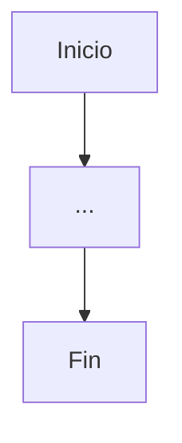

# Diagrama de Flujo
Un diagrama de flujo es un lenguaje grafico para la representación grafica de un proceso, en el cual cada pasa de este, es representado mediante un símbolo particular, y además utiliza líneas con flechas para conectar los símbolos gráficos y expresar la secuencia y orden en que los pasos de un proceso se han ejecutado.

Un diagrama de flujo facilita la visualización de los detalles de las acciones que se ejecutan dentro de un proceso.

## Formas de los diagramas de flujos
Los diagramas de flujo poseen símbolos que permiten estructurar la solución de un problema de manera grafica. A continuación se muestran los elementos que conforman este lenguaje grafico.

1. Todo diagrama de flujo tiene un inicio y un fin.
   

2. Las flechas solo pueden verticales y horizontales
~~~mermaid
flowchart TD
Start --> Stop
~~~
~~~mermaid
flowchart LR
Start --> Stop
~~~
3. Indica proceso
   ~~~mermaid
   flowchart LR
   id1(Some text)
   ~~~
4. Indica impresora
   ~~~mermaid
   flowchart LR
   A[\Some text/]

   ~~~
5. Indica entrada y salida
   ~~~mermaid
   flowchart LR
   id1[/Some text/]

   ~~~
6. Indica conector
   ~~~mermaid
   flowchart LR
   id1(((Some text)))
   ~~~
7. La flecha no puede tener nada
8. Decision. Valida una condición y toma uno u otro 
   ~~~mermaid
	flowchart LR   
	id1{Some text}
   ~~~

- La notación del diagrama de flujo va a ser diferente dependiendo el lenguaje de programación
- Se recomienda poner comentarios que expresen o ayuden a entender un bloque de símbolos
- Si la extensión de un diagrama ocupa mas de una pagina, es necesario utilizar y numerar los símbolos adecuados
- A cada símbolo solo le puede llegar una línea de dirección de flujo
- [[Notación Camello]]. Para nombrar variables y nombres de funciones se debe ha uso de la notación camello
## Estructuras de control 
Permite la ejecución condicional y la repetición.
### Estructura de control secuencial

| **Aritmética** | **Asignación** |
| :------------: | :------------: |
|       +        |       <-       |
|       -        |       =        |
|       **       |                |
|       /        |                |
