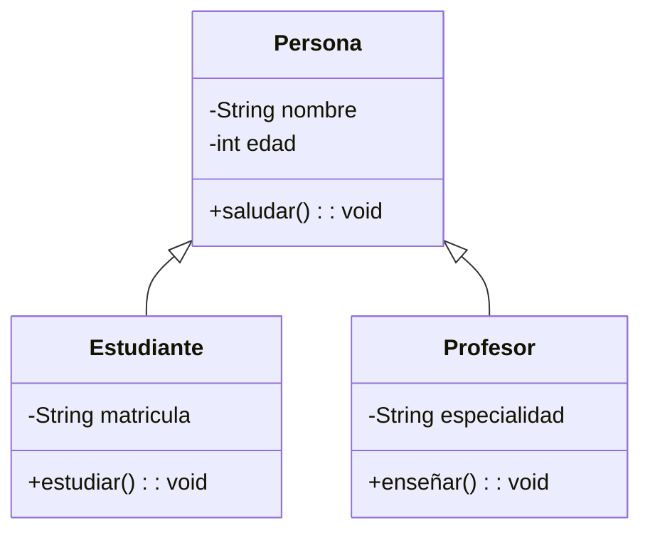

# Diagramas de clases UML
Son una parte fundamental de la **modelación orientada a objetos** en el lenguaje de modelado unificado (**UML, Unified Modeling Language**).
## 📌 **¿Qué es un diagrama de clases UML?**

Un **diagrama de clases UML** es una representación gráfica de la estructura de un sistema, mostrando **clases, atributos, métodos y las relaciones entre ellas**. Se utiliza en el diseño y análisis de software para visualizar cómo interactúan los objetos dentro de un sistema.
## 📌 **Elementos principales de un diagrama de clases UML**

1. **Clases** 📦
    - Representan **entidades** o **objetos** dentro del sistema.
    - Se representan con un rectángulo dividido en tres secciones:
        - **Nombre de la clase** (parte superior).
        - **Atributos** (parte media).
        - **Métodos o funciones** (parte inferior).
2. **Relaciones entre clases** 🔗
    - **Asociación** → Conexión entre dos clases que interactúan.
    - **Herencia (Generalización)** → Una clase hija hereda atributos y métodos de una clase padre.
    - **Agregación** → Una clase contiene a otra, pero ambas pueden existir por separado.
    - **Composición** → Una clase contiene a otra y depende completamente de ella.
    - **Dependencia** → Una clase utiliza temporalmente a otra.
## 📌 **Ejemplo de diagrama de clases UML**

-  **Explicación del diagrama**:
	- **Persona** es la clase padre.
	- **Estudiante** y **Profesor** heredan de **Persona** (relación de herencia `<|--`).
	- Ambas clases pueden tener atributos y métodos adicionales.
## 📌 **¿Para qué se usan los diagramas de clases UML?**

✅ Diseñar la estructura de sistemas antes de programarlos.  
✅ Mejorar la comprensión de la arquitectura del software.  
✅ Documentar proyectos de software para mantenimiento y escalabilidad.  
✅ Facilitar la comunicación entre desarrolladores y analistas.